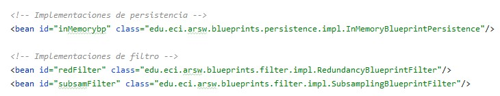
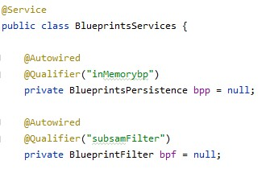
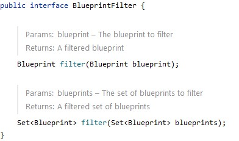
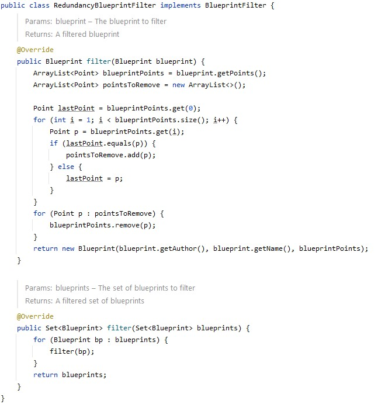
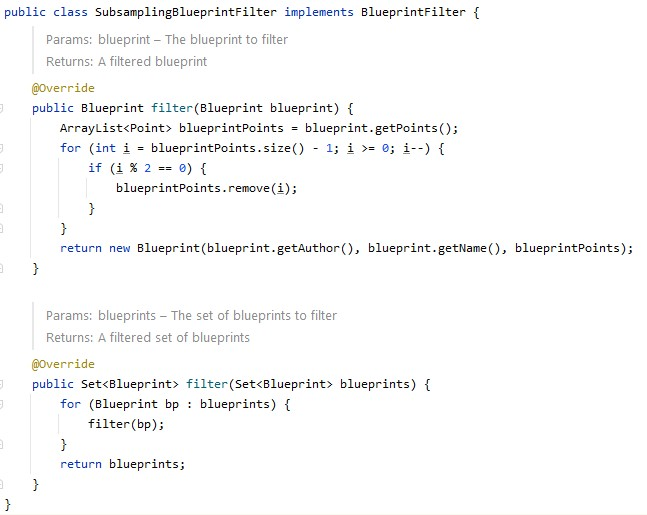
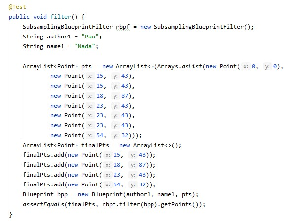
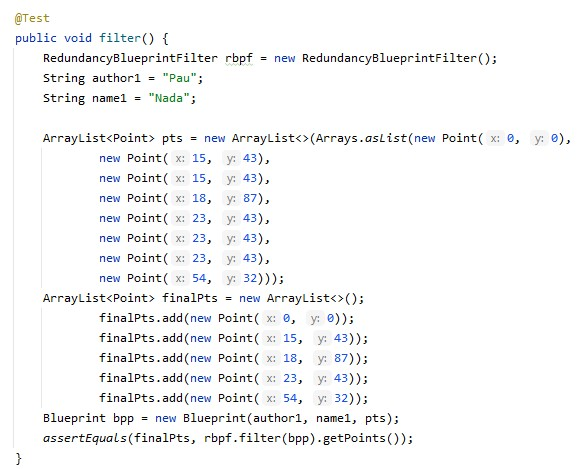

### Escuela Colombiana de Ingeniería

### Arquitecturas de Software
## Laboratorio Componentes y conectores  Middleware- gestión de planos
### Dependencias
* [Ejercicio introductorio al manejo de Spring y la configuración basada en anotaciones](https://github.com/ARSW-ECI-beta/DIP_DI-SPRING_JAVA-GRAMMAR_CHECKER).

### Descripción
En este ejercicio se va a construír un modelo de clases para la capa lógica de una aplicación que permita gestionar planos arquitectónicos de una prestigiosa compañia de diseño. 

---

### Parte I.📂

---
Configure la aplicación para que funcione bajo un esquema de inyección de dependencias, tal como se muestra en el diagrama anterior.

	Lo anterior requiere:

	* Agregar las dependencias de Spring.
	* Agregar la configuración de Spring.
	* Configurar la aplicación -mediante anotaciones- para que el esquema de persistencia sea inyectado al momento de ser creado el bean 'BlueprintServices'.
	

---
Las clases inyectables se definieron en el archivo [applicationContext.xml](src/main/resources/applicationContext.xml), a estas clases
se les asigna un ID como se muestra a continuación:

> Para realizar la inyección de dependencias, se utilizan las anotaciones @Autowired y @Qualified en la clase en la cual se 
desea realizar la inyección, esto es realizado como se muestra a continuación:

### Parte II.📂

---
Complete los operaciones getBluePrint() y getBlueprintsByAuthor(). Implemente todo lo requerido de las capas inferiores (por ahora, el esquema de persistencia disponible 'InMemoryBlueprintPersistence') agregando las pruebas correspondientes en 'InMemoryPersistenceTest'.

---
> Se realizó la impementación en la clase [InMemoryBlueprintPersistence](src/main/java/edu/eci/arsw/blueprints/persistence/impl/InMemoryBlueprintPersistence.java),
ya que esta es la única implementación que se tiene por el momento de la persistenca de planos.
Esta implementación se muestra a continuación:

 

### Parte III.📂

---
Haga un programa en el que cree (mediante Spring) una instancia de BlueprintServices, y rectifique la funcionalidad del mismo: registrar planos, consultar planos, registrar planos específicos, etc.

---

El programa se muestra a continuación:

 

### Parte IV.📂

---
Se quiere que las operaciones de consulta de planos realicen un proceso de filtrado, antes de retornar los planos consultados. Dichos filtros lo que buscan es reducir el tamaño de los planos, removiendo datos redundantes o simplemente submuestrando, antes de retornarlos. Ajuste la aplicación (agregando las abstracciones e implementaciones que considere) para que a la clase BlueprintServices se le inyecte uno de dos posibles 'filtros' (o eventuales futuros filtros). No se contempla el uso de más de uno a la vez:
	* (A) Filtrado de redundancias: suprime del plano los puntos consecutivos que sean repetidos.
	* (B) Filtrado de submuestreo: suprime 1 de cada 2 puntos del plano, de manera intercalada.

---

> Para realizar esta tarea exitosamente, se inició creando una interfaz de filtros, la cual podemos observar en la siguiente imagen:

De esta interfaz, extendemos dos implementaciones:

- Filtrado de Redundancias:

- Filtrado de submuestreo:

> Con estas implementaciones realizamos la inyección de dependencias en la clase principal de servicios como
se mostró en el primer punto y tendremos la funcionalidad de filtros completamente implementada e integrada.

### Parte V.📂

---
5. Agrege las pruebas correspondientes a cada uno de estos filtros, y pruebe su funcionamiento en el programa de prueba, comprobando que sólo cambiando la posición de las anotaciones -sin cambiar nada más-, el programa retorne los planos filtrados de la manera (A) o de la manera (B).

---

>Se implementaron pruebas estratégicas buscando que los filtros eliminen los puntos correctos según su tipo, estas
pruebas se pueden observar a continuación:

> El cambio de implementación se realiza cambiando el ID de la anotación en la clase principal, como se muestra en el primer punto.
